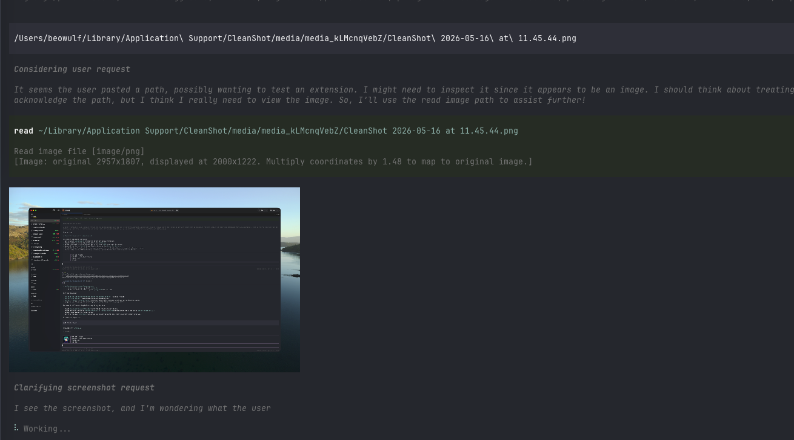

# paster

`paster` is a pi extension that turns pasted, drag-dropped, or clipboard-provided images into first-class image attachments.

Instead of leaving raw local image paths in your prompt, paster replaces them with readable placeholders such as `[#image 1]` and attaches the matching image content to the same user turn.

## Preview

<!-- Replace this with the project screenshot/demo image. -->



## Why this exists

Terminal image workflows are awkward: dragging a screenshot into a terminal usually inserts a local file path, and pasting an image from the clipboard may require special handling. For multimodal models, that path is not enough—the image bytes need to be attached to the message.

`paster` bridges that gap for pi interactive mode:

1. Paste or drag/drop an image path into the editor.
2. The path is replaced with a placeholder like `[#image 1]`.
3. The image is stored in memory immediately.
4. When you submit, pi sends your text with the placeholder plus the actual image attachment.
5. The submitted image is rendered back in the conversation so you can confirm what was attached.

## Features

- Converts pasted or drag-dropped image paths into placeholders.
- Supports PNG, JPEG, WebP, and GIF by magic-byte detection.
- Supports absolute, relative, home-relative, quoted, and shell-escaped paths.
- Attaches only placeholders still present in the submitted prompt.
- Preserves attachment order by first placeholder occurrence.
- Shows submitted image previews in chat history.
- Optional custom editor integration:
  - cursor-based image preview above the input
  - atomic deletion of whole image placeholders
  - macOS clipboard image paste via pi's image paste keybinding

## Installation

Once published to npm, install the package with pi:

```bash
pi install npm:pi-paster
```

Or try it without installing:

```bash
pi -e npm:pi-paster
```

For local development/testing:

```bash
pi -e .
```

## Usage

Start pi interactive mode with the extension enabled.

Then paste or drag/drop an image path:

```text
/Users/me/Desktop/screenshot.png
```

The editor will insert:

```text
[#image 1]
```

You can also write normal text around it:

```text
What is wrong in this screenshot? [#image 1]
```

On submit, the text and matching image attachment are sent together.

## Clipboard image paste

On macOS, pi exposes an image paste action through its keybinding system. In the default pi keybindings this is `Ctrl+V`.

`Cmd+V` is handled by the terminal emulator itself. In Ghostty, if the clipboard contains text, Ghostty pastes the text into pi; if the clipboard contains only image data, pi may receive no input. Use pi's image paste keybinding for direct clipboard-image paste.

## Configuration

By default all editor integrations are enabled.

To customize behavior, load a small wrapper extension:

```ts
import { createPaster } from "pi-paster";

export default createPaster({
  customEditor: {
    enabled: true,
    showImagePreview: true,
    deletePlaceholderAsBlock: true,
  },
});
```

### Options

| Option                                  | Default | Description                                                                                                                 |
| --------------------------------------- | ------- | --------------------------------------------------------------------------------------------------------------------------- |
| `customEditor.enabled`                  | `true`  | Replaces pi's input editor with paster's editor integration. Disable this to keep pi's default editor.                      |
| `customEditor.showImagePreview`         | `true`  | Shows an image preview above the input when the cursor is inside an image placeholder. Requires `customEditor.enabled`.     |
| `customEditor.deletePlaceholderAsBlock` | `true`  | Makes backspace/delete remove the whole placeholder when editing inside or adjacent to it. Requires `customEditor.enabled`. |

When `customEditor.enabled` is `false`, paster still handles bracketed terminal paste/drop image paths, but cursor previews, atomic placeholder deletion, and paster's clipboard-image handler are disabled.

## Development

This repo uses Vite+ via `vp` with pnpm.

```bash
vp install
vp check
vp test run
vp run build
```

The package manifest exposes the extension through:

```json
{
  "pi": {
    "extensions": ["./src/index.ts"]
  }
}
```
